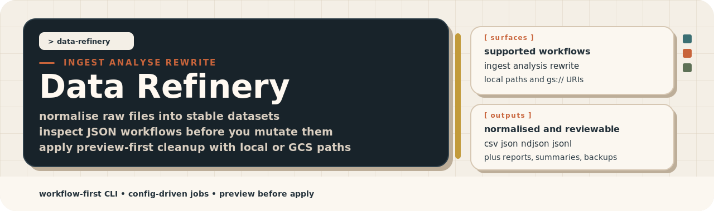

<div align="center">
  
</div>

<br>


## Overview

Data Refinery gives you one CLI for three distinct jobs: normalize raw files
into a stable dataset, inspect structured data without changing it, and then
run preview-first cleanup when you are ready to mutate source records. The
product surface is intentionally workflow-first so the first useful command and
the first safe change are both obvious.

This release consolidates the normalization workflow into the current CLI. You
can now convert CSV, TSV, XLSX, XML, JSON, NDJSON, and JSONL inputs into one
unified schema, then write the result locally or to `gs://...`.

| Workflow | Primary command | Use it when you need to | Main outputs |
| --- | --- | --- | --- |
| Ingest | `./data-refinery ingest ...` | Convert heterogeneous source files into one standardized dataset. | `.csv`, `.json`, `.ndjson`, `.jsonl`, plus optional `.json` run summary |
| Analysis | `./data-refinery ...` or `./data-refinery analyse ...` | Validate keys, review duplicates, search records, discover schema, and generate reports. | stdout plus optional saved reports and derived artifacts |
| Rewrite | `./data-refinery rewrite ...` | Preview or apply targeted cleanup rules to JSON, NDJSON, JSONL, and XML source data. | Preview summary, logs, backups, and applied changes |

### Format matrix

Use this matrix when you need to know which workflow accepts which source
format today.

| Format | Ingest input | Analysis input | Rewrite input | Notes |
| --- | --- | --- | --- | --- |
| CSV | Yes | Yes | No | Rewrite does not mutate tabular files in place. |
| TSV | Yes | Yes | No | Rewrite does not mutate tabular files in place. |
| XLSX | Yes | Yes | No | Rewrite does not mutate spreadsheets in place. |
| XML | Yes | Yes | Yes | Ingest and rewrite use `xmlRecordPath` to treat repeated elements as logical records. |
| JSON | Yes | Yes | Yes | Ingest reads document-style JSON. Rewrite uses JSON-family mutation rules. |
| NDJSON | Yes | Yes | Yes | Line-oriented JSON stream. |
| JSONL | Yes | Yes | Yes | Line-oriented JSON stream. |


The source for this diagram lives in
[`assets/flow-overview.d2`](assets/flow-overview.d2).

<br>


## Prerequisites

You can run Data Refinery locally with only the repository toolchain. GCS-backed
workflows need Google Cloud credentials and bucket access in addition to the
local setup.

### Local-only use

For local files and the checked-in examples, you need:

- `mise` installed on your machine
- `mise install` run from the repository root
- `mise run build` when you want the `./data-refinery` binary in the repo root

### GCS use

For any `gs://...` input or output path, you also need:

- Google Application Default Credentials available to the process
- IAM access to read the source buckets or objects you reference
- IAM access to write any destination buckets or objects you target
- a local ingest mapping file, because `-mapping-file` does not load from
  `gs://`

The most common local setup path is:

```sh
gcloud auth application-default login
```

If you use service accounts instead, make sure the process environment exposes
valid ADC credentials before you run the CLI.

<br>


## Quick start

The fastest path through the repository uses the checked-in fixtures. These
steps install the toolchain, build the binary, normalize sample input, inspect
sample data, and preview a cleanup run.

1. Install the local toolchain and build the binary.

   ```sh
   mise install
   mise run build
   ```

2. Normalize first-class CSV, TSV, and JSON inputs into one unified dataset.

   ```sh
   ./data-refinery ingest -config examples/ingest-simple-config.json
   ```

3. Run a read-only validation pass against the repository test data.

   ```sh
   ./data-refinery -validate -path ./test_data -key id
   ```

4. Run a headless analysis with an explicit app config.

   ```sh
   ./data-refinery --app-config examples/test_full_advanced.json -headless
   ```

5. Preview a rewrite workflow before you apply any mutation.

   ```sh
   ./data-refinery rewrite -config examples/rewrite-delete-config.json
   ```

For GCS paths, authenticate with Google Application Default Credentials before
you run the command. Data Refinery uses ambient Google credentials rather than
a separate auth layer.

<br>


## Workflows

Data Refinery is easiest to use when you treat `ingest`, `analysis`, and
`rewrite` as separate stages instead of one large mode with too many flags.
Most teams will normalize first, inspect second, and only then apply cleanup.

### Ingest

Ingest is the entry point when your source files do not already share a stable
shape. It supports CSV, TSV, XLSX, XML, JSON, NDJSON, and JSONL inputs.
Mapping files can use either the older filename-keyed format or the newer
structured format with exact matches, globs, nested paths, defaults, and
attribute capture.

Supported normalized outputs:

- `.csv`
- `.json`
- `.ndjson`
- `.jsonl`

Use `.csv` only when every normalized row stays scalar. If the normalized row
contains nested data such as the unified `Attributes` array, the run fails with
an error that tells you to use `.json`, `.ndjson`, or `.jsonl`.

For XML inputs, set `xmlRecordPath` in the matching mapping rule when repeated
elements should be treated as logical records.

First useful ingest commands:

- `./data-refinery ingest -config examples/ingest-simple-config.json`
- `./data-refinery ingest -config examples/ingest-complex-config.json`
- `./data-refinery ingest -config examples/ingest-config.json`

The normalized schema preserves the older ingestion contract:
`Id`, `FirstName`, `LastName`, `Email`, `Mobile`, `PostCode`, `DataSource`,
`SourceCreatedDate`, `SourceModifiedDate`, `SourceFile`, `Attributes`, and
`BQInsertedDate`.

### Analysis

Analysis is the default command surface. Use it when you need to understand a
structured dataset before you decide whether anything should change. It can
inspect tabular files, XML documents, and JSON-family data through the same
reader layer.

Analysis supports:

- TUI-driven interactive review
- Headless validation and duplicate checks
- Search targets
- Schema discovery
- Derived cleanup artifacts
- Local duplicate purge when you explicitly enable it

Supported analysis inputs:

- `.csv`
- `.tsv`
- `.xlsx`
- `.xml`
- `.json`
- `.ndjson`
- `.jsonl`

First useful analysis commands:

- `./data-refinery -validate -path ./test_data -key id`
- `./data-refinery -headless -path ./test_data -key id -output json`
- `./data-refinery --app-config examples/test_full_advanced.json -headless`

Headless and validation runs print reports to stdout. TUI runs render the
interactive review in the terminal. When you enable saved outputs, analysis can
also write text reports, JSON reports, search results, schema exports, and
derived cleanup artifacts under `logPath`.

Use `-xml-record-path` when repeated XML elements should be treated as logical
records. Without it, analysis treats the whole XML document as one record.

### Rewrite

Rewrite is the mutation stage. It operates on JSON, NDJSON, JSONL, and XML
inputs and is designed around a preview-first path so you can confirm scope
before any apply-mode run writes changes.

Rewrite supports:

- deleting whole rows by top-level key match
- deleting matching items from nested arrays
- recursively updating values by key
- filtering delete or update operations by state or ID
- loading long target lists from CSV files

For XML rewrites, set `-xml-record-path` so repeated elements are treated as
logical records. Rewrite mutates the XML structure and then serializes the
document back to XML in apply mode.

First useful rewrite commands:

- `./data-refinery rewrite -config examples/rewrite-delete-config.json`
- `./data-refinery rewrite -config examples/rewrite-update-config.json`
- `./data-refinery rewrite -path ./test_data -top-level-key customer_id
  -top-level-vals ./ids.csv -mode preview`

Apply mode writes changes and creates backups. Preview mode reports what would
happen without mutating the source dataset.

<br>


## What it can and can't do

Data Refinery is intentionally narrow. It focuses on normalization, inspection,
and targeted cleanup workflows rather than trying to be a general-purpose ETL
platform.

### What it can do today

Data Refinery can do these jobs today:

- normalize CSV, TSV, XLSX, XML, JSON, NDJSON, and JSONL inputs into one standard
  schema
- write normalized output locally or to `gs://...`
- export normalized datasets as `.csv`, `.json`, `.ndjson`, or `.jsonl`
- preserve the existing unified schema and the older filename-keyed mapping
  format
- analyse CSV, TSV, XLSX, XML, JSON, NDJSON, and JSONL datasets in TUI,
  headless, or validation mode
- generate reports, search results, schema outputs, and derived cleanup artifacts
- preview and apply rewrite rules to JSON-family files and XML documents with
  backup-aware apply mode

### What it can't do yet

Data Refinery does not do these things yet:

- ingest or export Parquet
- ingest or export Avro
- write directly to BigQuery after normalization
- rewrite CSV, TSV, or XLSX source files in place
- load ingest mapping files from `gs://`; mappings must be local files
- export CSV when normalized rows contain nested fields such as `Attributes`
- auto-expand arbitrary unknown nested objects into `Attributes` without
  explicit mappings

<br>


## CLI and package surface

The supported interface for this repository is the CLI plus the config files
and examples checked into the repo. That is the stable surface to automate
against. The Go packages under `internal/` are implementation details, not a
public library API.

If you need programmatic use today, call the CLI from your own automation or
copy the internal logic intentionally with the expectation that it can change
between releases.

### Command model

The root command defaults to analysis. The explicit subcommands make the
workflow boundaries clearer.

| Command | Purpose |
| --- | --- |
| `./data-refinery --help` | Show the top-level workflow model and the first useful commands. |
| `./data-refinery analyse --help` | Show analysis help. `analyze` and `analysis` are aliases. |
| `./data-refinery ingest --help` | Show ingest help. `normalize` and `normalise` are aliases. |
| `./data-refinery rewrite --help` | Show rewrite help and rewrite-specific flags. |

### Help and examples

The CLI help now explains each workflow in the same structure as this README:
what the command is for, when to use it, which outputs it produces, and which
flags matter first.

Run these commands when you want the current help text directly from the
binary:

```sh
./data-refinery --help
./data-refinery ingest --help
./data-refinery analyse --help
./data-refinery rewrite --help
```

When you are working from source and do not want to type raw `go run`
commands, use the matching `mise` tasks instead:

```sh
mise run cli:help
mise run cli:help:analysis
mise run cli:help:ingest
mise run cli:help:rewrite
```

### Config surfaces

Data Refinery uses three config shapes on purpose. That keeps the default path
small and keeps advanced controls behind an explicit file boundary.

| Config surface | Used by | Notes |
| --- | --- | --- |
| Base app config | analysis and shared runtime settings | Best passed explicitly with `--app-config` for repeatable runs |
| Portable ingest job config | `ingest -config` | Relative paths resolve from the ingest config file location |
| Portable rewrite job config | `rewrite -config` | Relative paths resolve from the rewrite config file location |

### Safety model

Read-only analysis is the default. Guarded workflows add extra checks so local
write targets and config trust stay explicit.

Guarded workflows include:

- ingest output writes
- rewrite apply mode
- local purge inside the TUI
- analysis runs that write derived cleanup artifacts

The main safety controls are:

- `--app-config` for explicit config trust
- `--allow-implicit-config` when you intentionally rely on discovered config
- `--approved-output-root` for local write boundaries
- `--yes-i-know-what-im-doing` only when you mean to bypass those guards

<br>


## Configuration and examples

The repository ships examples for the first success path and for the more
complicated refactor patterns. Start from the checked-in examples instead of
starting from an empty file.

### Recommended examples

Use these examples when you want the shortest route to a specific workflow.

| File | Use it when you want to |
| --- | --- |
| [`examples/ingest-simple-config.json`](examples/ingest-simple-config.json) | Normalize the simplest CSV, TSV, and JSON walkthrough. |
| [`examples/ingest-simple-mappings.yaml`](examples/ingest-simple-mappings.yaml) | Start from direct field-to-schema mappings. |
| [`examples/ingest-complex-config.json`](examples/ingest-complex-config.json) | Run a nested JSON normalization walkthrough. |
| [`examples/ingest-complex-mappings.yaml`](examples/ingest-complex-mappings.yaml) | Map nested paths into the unified `Attributes` array. |
| [`examples/ingest-config.json`](examples/ingest-config.json) | Run the mixed CSV and JSONL ingest walkthrough. |
| [`examples/test_full_advanced.json`](examples/test_full_advanced.json) | Run a compact advanced analysis walkthrough. |
| [`examples/rewrite-delete-config.json`](examples/rewrite-delete-config.json) | Preview or apply row deletion from a portable rewrite config. |
| [`examples/rewrite-update-config.json`](examples/rewrite-update-config.json) | Preview or apply recursive updates with backups. |
| [`examples/smoke/`](examples/smoke/) | Inspect the checked-in fake dataset that powers the CLI smoke suite. |

### Complex normalization example

The complex ingest example covers the pattern you asked for: taking nested
key-value structures and standardizing them into an array of objects instead of
preserving the original field names.

That example maps explicit nested paths into:

```json
[
  { "Key": "preference.language", "Value": "en" },
  { "Key": "loyalty.status", "Value": "gold" }
]
```

Current boundary: Data Refinery supports explicit nested-path mappings today.
It does not yet auto-expand arbitrary unknown nested objects into `Attributes`
without those mappings being named in the config.

### More repository guides

The root README is the shortest path into the project. These focused guides go
deeper when you need more detail:

- [`examples/README.md`](examples/README.md) for example selection and path behavior
- [`examples/ADVANCED_FEATURES.md`](examples/ADVANCED_FEATURES.md) for advanced analysis
- [`examples/REWRITE_WORKFLOWS.md`](examples/REWRITE_WORKFLOWS.md) for
  preview-first rewrite jobs
- [`tests/cli_smoke.bats`](tests/cli_smoke.bats) for the end-to-end CLI smoke
  matrix

<br>


## Behaviour diagrams

The diagrams in this section are stored as D2 source files in `assets/` and
rendered to SVG for direct embedding in this README. Regenerate them with
`mise run render-diagrams`.

### Overall flow

This diagram shows the main handoff between the three workflows.


Source: [`assets/flow-overview.d2`](assets/flow-overview.d2)

### Ingest behavior

This diagram shows how ingest matches source files, normalizes records, and
branches on the chosen output format.


Source: [`assets/flow-ingest.d2`](assets/flow-ingest.d2)

### Analysis behavior

This diagram shows the read-only analysis flow, including the optional TUI-only
local purge branch.


Source: [`assets/flow-analysis.d2`](assets/flow-analysis.d2)

### Rewrite behavior

This diagram shows how rewrite loads rules, runs in preview or apply mode, and
branches to either summaries or committed changes with backups.


Source: [`assets/flow-rewrite.d2`](assets/flow-rewrite.d2)

<br>


## Development

The repository now includes the same lightweight README asset workflow used in
the reference skills repository. The visual assets are generated, not hand
edited, so documentation changes stay maintainable. The default local
development surface is `mise`, with `hk` available for pre-commit and
pre-push-style checks.

| Command | Purpose |
| --- | --- |
| `mise install` | Install Go, Python, and the D2 CLI declared in `mise.toml`. |
| `mise run build` | Build the `./data-refinery` binary. |
| `mise run tests:go` | Run the Go test suite. |
| `mise run tests:bats` | Run the checked-in CLI smoke suite against real fake data. |
| `mise run cli:smoke` | Run the same BATS smoke suite through the public task alias. |
| `mise run test` | Run the Go test suite. |
| `mise run go:fmt` | Apply Go formatters defined in `.golangci.yaml`. |
| `mise run go:fmt:check` | Check Go formatting without rewriting files. |
| `mise run go:lint` | Run `golangci-lint` using the repo config. |
| `mise run check:quick` | Run the fast repo, formatting, lint, and CLI-help checks. |
| `mise run check` | Run the full local verification suite, including tests. |
| `mise run cli:help` | Print the top-level CLI help directly from source. |
| `mise run generate-assets` | Regenerate the banner and section header SVGs. |
| `mise run render-diagrams` | Render the D2 diagrams in `assets/` to SVG. |
| `mise run docs-assets` | Regenerate both README art and D2 diagram outputs. |
| `mise run hk:install` | Install `hk` git hooks for this repository. |
| `mise run hk:pre-commit` | Run the local fixing hook profile without creating a commit. |
| `mise run hk:pre-push` | Run the verifier hook profile locally before you push. |

The asset scripts live in [`scripts/generate_assets.py`](scripts/generate_assets.py)
and [`scripts/render_diagrams.sh`](scripts/render_diagrams.sh). Generated files
live in [`assets/`](assets/). The hook configuration lives in
[`hk.pkl`](hk.pkl), and the Go lint and formatter policy lives in
[`.golangci.yaml`](.golangci.yaml).

The checked-in CLI smoke corpus lives under
[`examples/smoke/`](examples/smoke/), and the BATS entrypoint lives in
[`tests/cli_smoke.bats`](tests/cli_smoke.bats). `hk` runs the BATS smoke suite
on pre-commit, and the full verifier profile runs formatting checks, lint, Go
tests, BATS, and script validation.

<br>


## Roadmap

The near-term roadmap is intentionally narrow. The next work expands supported
data targets and destinations without changing the three-stage workflow model.

### Soon to come

- Parquet support for ingest and unified export workflows
- Avro support for ingest and unified export workflows
- BigQuery as a direct destination after normalization
- richer nested attribute expansion patterns for complex input objects

## Next steps

If you are picking up the project for the first time, use this sequence:

1. Run `./data-refinery ingest -config examples/ingest-simple-config.json`.
2. Run `./data-refinery --app-config examples/test_full_advanced.json -headless`.
3. Review outputs under `logPath`.
4. Run `./data-refinery rewrite -config examples/rewrite-delete-config.json`.
5. Read [`examples/README.md`](examples/README.md) and choose the next example
   that matches your own dataset.
