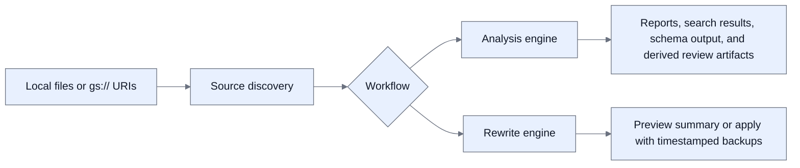

# Data Refinery

Data Refinery helps you inspect large JSON, NDJSON, and JSONL datasets and run
preview-first cleanup jobs across local storage and Google Cloud Storage
(GCS). Use it when you need one tool for duplicate analysis, schema discovery,
targeted record review, and operational rewrite workflows with backups.

Data Refinery keeps analysis and mutation separate on purpose. You can stay in
read-only analysis until you understand the scope of a cleanup, then move to a
guarded mutation flow when you are ready to act.

> **Start here:** Build the binary, validate a key against `./test_data`, then
> run one headless analysis and one rewrite preview. The commands in the next
> section get you there in a few minutes.

## Why Data Refinery exists

Data Refinery replaces the usual mix of one-off scripts, manual spot checks,
and risky in-place edits with a repeatable workflow. It gives you a fast way
to understand a dataset first and only mutate data once you can explain the
change you are about to make.

- Data Refinery brings duplicate analysis, targeted search, schema discovery,
  and cleanup planning into one CLI, so you do not need separate utilities for
  each stage of the job.
- Data Refinery supports both local paths and `gs://` URIs, which lets you use
  the same operating model whether your data sits on disk or in GCS.
- Data Refinery keeps mutation workflows preview-first and backup-aware, which
  lowers the chance of making a large cleanup change without context or a
  recovery path.

## Quick start

This quick start uses the repository's checked-in fixture data so you can see
the main workflows without preparing your own dataset first. The local
commands work without any cloud setup.

1. Install the toolchain and build the binary.

   ```sh
   mise install
   go build -o data-refinery ./cmd/data-refinery
   ```

2. Run a fast key validation pass against the sample data.

   ```sh
   ./data-refinery -validate -path ./test_data -key id
   ```

3. Run a full headless analysis and save both text and JSON reports.

   ```sh
   ./data-refinery \
     -headless \
     -path ./test_data \
     -key id \
     -output txt \
     -output.txt=true \
     -output.json=true
   ```

4. Run an advanced analysis from an explicit app config instead of relying on
   implicit config discovery.

   ```sh
   ./data-refinery \
     --app-config examples/test_full_advanced.json \
     -headless
   ```

5. Preview a rewrite job from a portable rewrite config.

   ```sh
   ./data-refinery rewrite -config examples/rewrite-delete-config.json
   ```

> **Note:** For GCS paths, authenticate with Google Application Default
> Credentials before you run the command. Data Refinery uses your ambient
> Google credentials rather than a custom auth layer.

## Choose the right workflow

Data Refinery has two primary operating modes. Use analysis to understand the
dataset and use rewrite when you are ready to change source records.

| Workflow | Main command | Best for | Mutates source data |
| --- | --- | --- | --- |
| Analysis | `./data-refinery` or `./data-refinery -headless` | Duplicate review, key validation, search, schema discovery, derived cleanup artifacts, and interactive local purge | No, except local purge flows that you explicitly enable in the TUI |
| Rewrite | `./data-refinery rewrite ...` | Previewing or applying streamed cleanup rules to local files or GCS objects | Yes, in `apply` mode only |

The analysis command also accepts `analyse`, `analyze`, and `analysis` as
aliases if you prefer an explicit subcommand.

## How Data Refinery works

At a high level, Data Refinery resolves input sources, streams records through
either the analysis or rewrite engine, and writes logs or artifacts under a
controlled output path. The internal complexity stays behind those two user
interfaces.



## Analysis workflow

Use analysis when you need to understand a dataset before deciding whether it
needs a cleanup. Analysis can run in the TUI for interactive work or in
headless mode for scripts, CI, and repeatable validation jobs.

### Interactive analysis

Run the binary without `-headless` or `-validate` when you want a guided
terminal UI. The TUI lets you configure paths, worker counts, duplicate checks,
advanced analysis settings, and local purge flows in one place.

```sh
./data-refinery -path ./test_data
```

### Headless analysis and validation

Run headless mode when you want stdout output plus optional saved reports. Run
validation mode when you only need to confirm that a key exists and count how
often it appears.

```sh
./data-refinery \
  -headless \
  -path ./test_data,gs://example-bucket/orders \
  -key id \
  -output json
```

```sh
./data-refinery -validate -path ./test_data -key id
```

### Advanced analysis

Advanced analysis extends the read-only side of the tool with search targets,
custom duplicate hashing, schema discovery, and derived cleanup artifacts. The
recommended way to run it is with an explicit app config passed through
`--app-config`.

```sh
./data-refinery \
  --app-config examples/test_full_advanced.json \
  -headless
```

This example config enables search, selective duplicate hashing, schema
discovery, and a derived deletion output without mutating the source dataset:

```json
{
  "path": "./test_data",
  "key": "id",
  "logPath": "logs",
  "advanced": {
    "searchTargets": [
      {
        "name": "customer_match",
        "type": "direct",
        "path": "customer_id",
        "targetValues": ["cust-123"]
      }
    ],
    "hashingStrategy": {
      "mode": "selective",
      "includeKeys": ["id", "customer_id"],
      "algorithm": "fnv",
      "normalize": true
    },
    "deletionRules": [
      {
        "searchTarget": "customer_match",
        "action": "delete_matches",
        "outputPath": "logs/derived/test-full-pruned.jsonl"
      }
    ]
  }
}
```

### Analysis outputs

Analysis always prints a report to stdout, and it can also write files under
`logPath`. The exact file set depends on which features you enable for the
run.

- Data Refinery writes `analysis_summary_*.txt`,
  `analysis_details_*.txt`, and `analysis_report_*.json` when you enable the
  matching report outputs.
- Data Refinery writes `search_results_*.json` and
  `search_target_<name>_*.json` when advanced search is enabled.
- Data Refinery writes `schema_report_*.json`, `schema_report_*.csv`, or
  `schema_report_*.yaml` when schema discovery is enabled.
- Data Refinery writes `deletion_stats_*.json`, `deletion_summary_*.txt`, and
  any configured deletion-rule output paths when derived cleanup artifacts are
  enabled.

### Local purge

Local purge is the one mutation path that lives inside the analysis experience.
It lets you review duplicate IDs or duplicate rows in the TUI and then remove
the selected records from local files.

```sh
./data-refinery -path ./test_data -purge-ids
```

Local purge is not available for GCS inputs. It is treated as a guarded
mutation workflow, so the safety rules in a later section apply to it.

## Rewrite workflow

Use rewrite when the dataset is already scoped and you know which rows or
values need to change. Rewrite is CLI-only today and is designed for
line-oriented JSON, NDJSON, and JSONL jobs where you want a preview before an
apply.

### What rewrite can change

Rewrite focuses on a small set of predictable cleanup operations. You can
combine them with state and ID filters to keep the blast radius narrow.

- Rewrite can delete whole rows when a top-level key matches a target list.
- Rewrite can remove matching entries from a nested array inside each record.
- Rewrite can update a value recursively wherever a key appears in a row.
- Rewrite can read target values from a CSV file when the inline list would be
  too long to manage on the command line.

### Rewrite quick examples

These examples cover the most common rewrite jobs. Start with `preview`, then
switch to `apply` once the summary matches your expectation.

Preview a reusable cleanup config:

```sh
./data-refinery rewrite -config examples/rewrite-delete-config.json
```

Apply a reusable update config with backups:

```sh
./data-refinery rewrite -config examples/rewrite-update-config.json
```

Run a one-off preview directly from flags:

```sh
./data-refinery rewrite \
  -path gs://example-bucket/orders \
  -top-level-key status \
  -top-level-vals archived,cancelled \
  -mode preview
```

Use a CSV file as the target list source:

```sh
./data-refinery rewrite \
  -path ./test_data \
  -top-level-key customer_id \
  -top-level-vals ./ids.csv \
  -mode preview
```

The CSV reader expects a header row and one value per later row.

### Portable rewrite config

Rewrite configs are flat JSON job definitions that you pass with `-config`.
Local relative paths in `paths`, `logPath`, `backupDir`, and
`approvedOutputRoot` resolve from the rewrite config file directory.

```json
{
  "paths": [
    "../test_data/test2.json",
    "../test_data/search_test2.json"
  ],
  "workers": 4,
  "logPath": "../logs",
  "approvedOutputRoot": "../workspace-output",
  "mode": "preview",
  "topLevelKey": "customer_id",
  "topLevelValues": ["cust-456"]
}
```

Rewrite starts from the base app config, overlays the portable rewrite config
if you pass one, then applies any rewrite flags you set on the command line.

## Mutation safety model

Data Refinery now enforces extra checks around mutation workflows so that local
write targets and config trust are explicit. These checks do not affect normal
read-only analysis.

- Guarded mutation workflows include `rewrite -mode apply`, local purge inside
  the TUI, and analysis runs that write deletion-rule output files.
- If a guarded workflow picks up the base app config from implicit discovery,
  Data Refinery requires `--app-config`, `--allow-implicit-config`, or
  `--yes-i-know-what-im-doing` before it proceeds.
- Local write targets for guarded workflows must stay under
  `--approved-output-root` or `approvedOutputRoot`. If you do not set one,
  Data Refinery uses the current working directory as the default boundary.
- GCS rewrite targets are still supported, but the local log, backup, and
  artifact paths for the same run must satisfy the approved-root rule unless
  you intentionally bypass it.

> **Warning:** `--yes-i-know-what-im-doing` disables both the implicit-config
> guard and the approved-output-root guard. Use it only when you understand why
> the default safety model is blocking the run.

## Configuration

Data Refinery uses one base app config model for analysis and shared runtime
settings, then adds a separate portable config format for rewrite jobs. The
base model is where worker counts, log paths, and advanced analysis settings
live.

### Base app config

The base app config can come from defaults, environment variables, an explicit
`--app-config` file, or the first implicit config file that exists in the
supported search path. CLI flags always override loaded values for the current
run.

The load order is:

1. Built-in defaults.
2. Environment variables such as `DATA_REFINERY_PATH`,
   `DATA_REFINERY_KEY`, `DATA_REFINERY_WORKERS`,
   `DATA_REFINERY_LOG_PATH`, `DATA_REFINERY_CHECK_KEY`, and
   `DATA_REFINERY_CHECK_ROW`.
3. An explicit `--app-config <file>` path, or the first implicit match from
   `config/config.json`, `config.json`, `data-refinery.json`,
   `~/.data-refinery.json`, or `/etc/data-refinery/config.json`.
4. Command-line flags for the current invocation.

Using `--app-config` is the clearest way to keep a run self-contained and
auditable, especially for guarded mutation workflows.

### Important flags

These flags are the ones most people need once they move beyond the first
quick start.

| Scope | Flag | What it does |
| --- | --- | --- |
| Analysis and rewrite | `--app-config` | Loads a specific base app config file instead of relying on implicit config discovery. |
| Analysis and rewrite | `--approved-output-root` | Sets the local root that guarded mutation writes must stay under. |
| Analysis and rewrite | `--allow-implicit-config` | Opts into using an implicitly discovered app config for guarded mutation workflows. |
| Analysis and rewrite | `--yes-i-know-what-im-doing` | Bypasses the implicit-config and approved-output-root safety checks. |
| Analysis | `-headless` | Runs analysis without the TUI and prints the report to stdout. |
| Analysis | `-validate` | Runs a key validation pass instead of a full analysis. |
| Analysis | `-output.txt` and `-output.json` | Saves text or JSON report files under `logPath`. |
| Rewrite | `-config` | Loads a portable rewrite job definition. |
| Rewrite | `-mode preview` or `-mode apply` | Chooses whether the run only reports changes or writes them. |
| Rewrite | `-backup-dir` | Sets the local backup location used for apply-mode runs. |

## Repository guides

The root README is the fastest path into the project, but the repository also
includes focused guides for common jobs and deeper operational context.

- [examples/README.md](examples/README.md) helps you choose the right example
  config or workflow file for a specific job.
- [examples/ADVANCED_FEATURES.md](examples/ADVANCED_FEATURES.md) explains the
  advanced analysis model in more depth, including search targets and schema
  discovery.
- [examples/REWRITE_WORKFLOWS.md](examples/REWRITE_WORKFLOWS.md) focuses on
  preview-first rewrite jobs and reusable portable configs.
- [data-refinery-threat-model.md](data-refinery-threat-model.md) documents the
  security model and trust boundaries for the current codebase.
- [security_best_practices_report.md](security_best_practices_report.md)
  records the latest security review findings and remediations.

## Development

The repository is a standard Go module with `mise` support for tool
installation. These are the baseline commands to run before you push a change.

```sh
go test ./...
golangci-lint fmt ./...
golangci-lint run ./...
```

If the tools are missing in your shell, run `mise install` first.

## Next steps

If you are new to the project, this sequence gives you the shortest route from
orientation to a realistic cleanup workflow.

1. Run `./data-refinery -validate -path ./test_data -key id`.
2. Run `./data-refinery --app-config examples/test_full_advanced.json -headless`.
3. Read [examples/README.md](examples/README.md) and pick the next example that
   matches your dataset.
4. Run `./data-refinery rewrite -config examples/rewrite-delete-config.json` in
   preview mode before you attempt an apply.

## License

Data Refinery is licensed under the MIT License. See
[LICENSE](LICENSE) for the full text.
